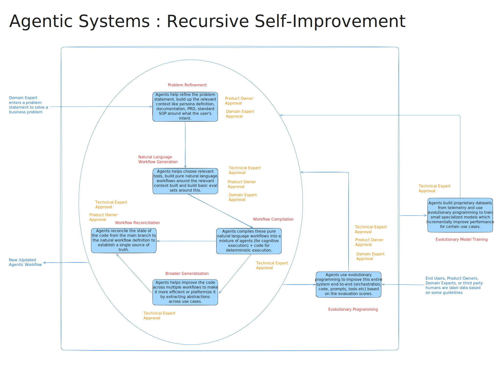

# System Architecture

## The Problem: Sales Intelligence at Scale

Swiggy Dineout Sales Executives spend **30 minutes to 3 hours** manually gathering restaurant performance data before each partner meeting. With hundreds of partners per city, this approach doesn't scale.

## The Solution: Restaurant Performance Agent

The Restaurant Performance Agent is an AI agent that generates a restaurant performance briefing for a given restaurant_id.

More details about the agent can be found in the [Restaurant Performance Agent PRD](restaurant-performance-agent-prd.md).

## Product Requirements

### Functional Requirements
1. **Restaurant Performance Analysis**
   - Generate 30-day performance summary (bookings, cancellations, revenue, ratings)
   - Identify notable trends and changes
   - Calculate key metrics (OPD, Revenue/GOV, Ads ROI)

2. **Ad Campaign Effectiveness**
   - Analyze spend, impressions, clicks, conversions, and ROI
   - Identify inefficiencies and highlights
   - Compare performance against benchmarks

3. **Peer Benchmarking**
   - Compare restaurant metrics with similar restaurants in same locality and cuisine
   - Identify overperforming and underperforming areas
   - Provide context for performance gaps

4. **Recommendations Engine**
   - Generate data-informed actionable recommendations
   - Suggest ad spend adjustments, discount optimizations, and campaign improvements
   - Provide specific monetary and percentage-based suggestions

### Input/Output Requirements
- **Input**: Single restaurant_id
- **Output**: Structured markdown or narrative format summary
- **Data Sources**: Mock datasets for restaurant_metrics, ads_data, peer_benchmarks

### Non-Functional Requirements

1. **Performance**
   - Generate insights within reasonable time (< 5 minutes)
   - Handle multiple restaurant requests efficiently
   - Scalable across hundreds of partners per city

2. **Quality & Accuracy**
   - Generate meaningful, context-rich summaries using LLMs
   - Handle uncertainty and low-confidence outputs appropriately, for example hallucinations
   - Provide actionable insights rather than perfect analytics accuracy

3. **Usability**
   - Clear, concise, and structured output format
   - Sales Executive-friendly language and presentation
   - Ready-to-use format for meetings and partner communications

4. **Technical Architecture**
   - Support for multiple LLM providers (OpenAI, Claude, Mistral, etc.)
   - Retrieval-Augmented Generation (RAG) or prompt chaining capabilities
   - Modular design for reusability and maintainability
   - Mock data generation and management

5. **Scalability**
   - Potential for batch processing multiple restaurants
   - Extensible architecture for additional data sources
   - Reusable modules as organizational capabilities

# Agentic Workflow Platform
Stepping back if you have to build a generic platform for building agentic workflows, it would have the following tenets: 

- The workflows are executed by an LLM in a loop.
- The workflow definitions are expressed in natural language.
- The workflows compile into code wherever deterministic execution is required.
- The workflows can call tools to gather context, reason and take actions.
- The workflows can build higher order abstractions by using exisitng tools and workflows as building blocks.
- The workflows can invoke the human in the loop where required.
- The workflows can be triggered by a schedule, event or a user request. 
- The workflows can be hierarchically nested to call other workflows as sub-workflows.
- These workflows can be paused and resumed based on the environment state and events.
- The workflows can save and read context for communication across the different steps in a single execution.
- The workflows can retain knowledge across executions to improve their performance over time.
- The workflows are self-healing to deal with errors and failures on the fly.
- The workflows are self-evolving to improve their code/prompts over time.

## Core System Flow

Agentic workflows are self-improving AI systems where agents continuously refine both their natural language workflow definitions and their compiled code implementations, with human expert oversight at critical decision points. The system aims to bridge business requirements with technical execution through recursive iterative improvement cycles.



### 1. **Initial Problem Input**
- **Product Owner** enters a problem statement to solve a business problem
- This triggers the entire agentic workflow system

### 2. **Problem Refinement**
- Agents help refine the problem statement, build up the relevant context
- They help author persona definition, documentation, PRD, standard SOP around what the user's intent.
- This is approved by Domain Expert and Product Owner after review

### 3. **Natural Language Workflow Generation**
- Agents helps build pure natural language workflows and build basic eval sets around this.
- Uses the problem statement, PRD (Product Requirements Document), and other relevant context
- Humans work with the agents to generate basic labelled evaluation sets that reflect the problem statement
- This is approved by Technical Expert, Domain Expert and Product Owner after review

### 4. **Workflow Compilation**
- Agents compile these pure natural language workflows into a mixture of:
  - **LLM Calls** (for cognitive execution)
  - **Code** (for deterministic execution)
- The Technical Expert is responsible for ensuring that the code is correct and works as expected, efficient and performant, they may suggest more changes and implement them with agents.

### 5. **Broader Generalization & Improvement**
- Agents helps improve the across multiple workflows code to make it more efficient or platformize it by extracting abstractions across use cases.
- These tasks are done asynchronously in the background and sent for review periodically to technical experts who review it and merge it.

### 6. **Workflow Reconciliation**
- Agents reconcile the state of code from the main branch and aligns with exact sources of truth
- Updates the natural language workflows accordingly
- Product owners, domain experts, and technical experts review this change to make sure they are in line with the source of truth. 

### 7. **Build Evaluation Systems**
- Meanwhile in parallel, agents build systems to evaluate other agents
- These evaluation systems comprise of the environment which will be used to evaluate the agents, the evaluation functions based on the rubric, fitness scores etc
- These evaluations are attested by domain experts to make sure labeled datasets (created in step 3) and agentic evaluations match.

### 8. **Evolutionary Programming**
- Agents use evolutionary programming to improve the entire system end-to-end
- This includes orchestration, code, tools, prompts, etc, and is done on the evaluation system built.
- Product owners, domain experts, and technical experts review this change before merging

### 8. **Evolutionary Model Training** 
- Agents use evolutionary programming to incrementally:
  - Build proprietary datasets
  - Write code to train small specialized models
  - Incrementally improve performance for specific use cases
- Technical experts attest the gains made through these experiments and approve the changes.

These recursively self-improvement systems are now a reality as it has been demonstrated in recent papers like [Alpha Evolve](https://deepmind.google/discover/blog/alphaevolve-a-gemini-powered-coding-agent-for-designing-advanced-algorithms/) and [Darwin Godel Machines](https://sakana.ai/dgm/), where the model continuously evolves its scaffolding (like DX, UX, UI, tool abstractions, response format, orchestration etc) to optimise certain metrics. 

This has the potential to mature into the 4th plane of improvement along with pretraining, RL and test time compute. 

## Current Implementation Scope
However, it would not be possible to build this entire system from scratch in scope of this project. This project implements a minute part of this loop to demonstrate what is possible

## Agentic Workflow : Curent Components and Implementation
We try to keep the architecture as simple as possible, and complexity be introduced only when there is a need. For example, the first version of an agentic workflow might be entirely LLM-driven, while future versions are optimized to be partially deterministic based on the use case.

This has some benefits. 

1. It helps avoid complexity in the beginning where requirements are not that clear.
2. It helps discover capabilities which would be not possible if we fix on a rigid hardcoded workflow prematurely. 
3. It helps domain experts in the complete transparency of the control flow and the prompts used and experiment with them. 

As we get to know more of the unknowns, we can optimize the workflow to be more deterministic and efficient.

These are some of the basic components that we need to build such a workflow. 


### 1. Augmented LLM 

An augmented LLM can be defined as an LLM with basic tools atatched to a running process with a file system and chat history.

These tools could be:

* Bash tool to run commands on the file system
* File system tool to read and write files
* Web search tool to search the web
* Todolist tool to manage a todo list
* Sub-agent tool to invoke other agents

Claude is the LLM of choice and Claude Code as the augmented LLM for this in this POC. However, the architecture is agnostic to it and it can be replaced with any other LLM provider if needed through changes in a single file. There are other similar CLI Augmented LLMs which can work with any LLM provider, which would be the choice for the future. 

Having an LLM running in a loop natively in the terminal console with access to bash and the file system seems like a new layer abstraction on top of the operating system, where you do not directly interact with the operating system, but rather with the LLM in natural language. It is like a personal SWE assistant with its own separate workspace and tools to help you get anything done. This is such a low-level primitive that it can be applied to any business domain. 

> Note:
> The current implementation uses Claude Code as the augmented LLM. However, the architecture is agnostic to it and it can be replaced with any other LLM provider if needed through changes in a single file. There are other similar CLI Augmented LLMs which can work with any LLM provider, which would be the choice for the future, for example:
> - [OpenAI Codex CLI](https://github.com/openai/codex) - Lightweight coding agent that runs in your terminal
> - [Aider](https://aider.chat/) - AI pair programming in your terminal with multi-LLM support
> - [Open Codex](https://github.com/codingmoh/open-codex) - Fully open-source command-line AI assistant supporting local language models

### 2. Natural Language Prompts

The workflow might consist of multiple instructions which are aggregated to send to the LLM. These instructions should also be treated as code and be following the single responsibility principle. That is, a single prompt should have a single responsibility. 

The current prompts folder contains modular prompt components that define the agentic workflow:

#### Business Logic
- **orchestration.md**: Defines the Senior Sales Manager agent that coordinates specialized analyst deployment
- **instructions.md**: General system instructions and behavior guidelines
- **analysis-categories.md**: Defines 5 specialized analyst roles:
  - Revenue Optimization Analyst
  - Risk & Quality Assessment Analyst  
  - Campaign Performance Analyst
  - Financial Health Analyst
  - Competitive Intelligence Analyst
- **data-sources.md**: Specifies available database tables and data schema
- **artifacts-protocol.md**: Standardizes output formats and file organization
- **output-format.md**: Defines structured report templates

### Utilities
- **tools.md**: Available tools for database operations and analysis
- **tools-build.md**: Instructions for building and extending tool capabilities

### Evaluation Framework
- **evaluation/evaluate-solution.md**: Quality assessment criteria and metrics

Each prompt follows single responsibility principle - one specific function per prompt file. The orchestration prompt coordinates these specialized components to create comprehensive restaurant performance briefings.

### 3. Additional Tools
These are deterministic parts which augment the LLM with more context or help the LLM take actions. The LLM itself can also write tools on the fly and execute them to get results. Essentially, the llm builds higher-order abstractions based on need, converting natural language to deterministic code. These tools are present in the tools folder.

The current tools folder contains utilities organized by function:

#### Database & Session Management (`tools/utils/`)
- **init_database.py**: Initializes SQLite database schema with restaurant performance tables
- **initialize_session.py**: Sets up analysis sessions for specific restaurants (e.g., `R001`)
- **get_tools.py**: Tool discovery utility to list available analysis capabilities

#### Evaluation & Metrics (`tools/evaluation/`)
- **initialize_db.py**: Sets up evaluation database for tracking analysis quality
- **get_trends.py**: Extracts performance trends and patterns from historical data
- **save_score.py**: Records analysis quality scores and performance metrics

All tools are designed to be LLM-augmented, meaning they can be dynamically composed and extended by the AI agents during analysis workflows. Tools follow the principle of building higher-order abstractions from basic operations. 

Currently, these tools are implemented as bash tools since that was the simplest way. They could also be implemented as MCP tools integrating into clients like Claude Code easily. 

### Artifacts
Currently, all the artifacts are stored in the local artifact directory grouped by session ID. 

# CLI API Interface

The system is exposed as a Python CLI application through `main.py`, providing two operational modes for restaurant performance analysis.

## Command Line Interface

### Generate Mode (Default)
Creates restaurant improvement recommendations using specialized AI analysts:

```bash
# Generate a restaurant performance briefing for a given restaurant_id
python main.py generate R001
```

#### Generate Mode - Development (Future)
In this mode, the LLM can create functions during its execution during the development phase which can be committed and used in production. This is a way to get the LLM to build tools on the fly.

```bash
# Generate a restaurant performance briefing for a given restaurant_id
python main.py generate-dev R001
```
The prompts tool.md and tools build.md provide these instructions. Essentially, an agent is working at the meta-level, building higher-order abstractions for the future. 

### Evaluate Mode
Evaluates existing session results against PRD criteria:

```bash
# Evaluate a specific session
python main.py evaluate --session-id abc123def456
```

### Optimize Mode (Future)
Will automatically improve code, prompts, and workflows based on performance metrics:
```bash
# Optimize system components based on evaluation results
python main.py optimize --session-id abc123def456
python main.py optimize --component prompts --metric accuracy
```

### Reconcile Mode (Future)  
Will synchronize system state with source of truth and update workflows accordingly:
```bash
# Reconcile session state with main branch
python main.py reconcile --session-id abc123def456
python main.py reconcile --sync-prompts --sync-tools
```

These modes will implement points **5** and **6** from the core system flow, enabling continuous improvement and state synchronization capabilities.

## Data Flow Architecture

```
CLI Input → Session Init → Prompt Loading → Claude Analysis → Output Generation
    ↓           ↓              ↓               ↓              ↓
Restaurant  Session ID    System Prompt    AI Agents     Structured
   ID       Generation    Assembly         Execution     Reports
```

## Future Components
* LLM Gateway
* Telemetry & Observability 
* Cloud Deployments
* Orchestrator (synchronous, asynchronous and batch processing)
* Persistence (database, distributed file system, etc.)
* User interfaces (CLI, API, GUI, etc.)

# Conclusion
This architecture and implementation serve as the founding stone of a larger platform shift where we will be able to build systems with humans and machines always in sync. 
